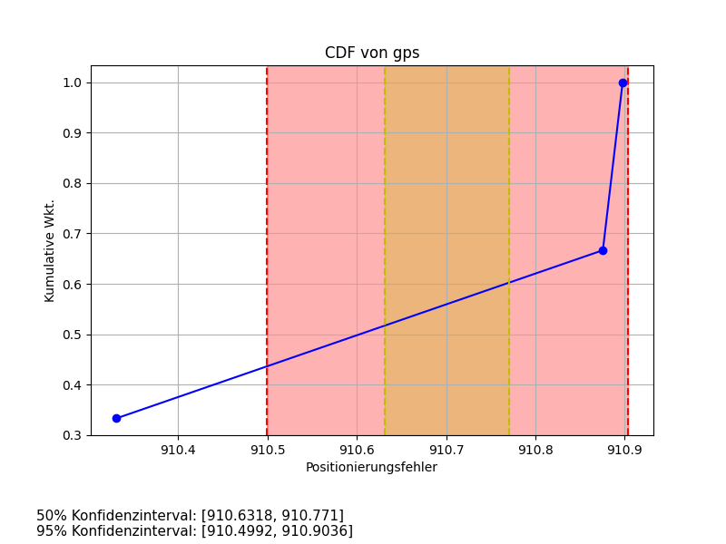

# LM_Auswertung

Eine einfache Console Application um Geodaten für "LM" auszuwerten. 
Die CSV Datei muss nach folgendem Schema aufgebaut sein:

|             |              |              |         |        |         |        |     |
|-------------|--------------|--------------|---------|--------|---------|--------|-----|
| routen name | sensor1 name | sensor2 name | ...     |        |         |        |     |
| GT long     | GT lat       | timestamp    | s1 long | s1 lat | s2 long | s2 lat | ... |

### Bedienung
``python main.py <files..>``, um die Testdaten zu evaluiren also:

``python main.py demo.csv demo2.csv ``

Generierte Plots stehen dann in der Ordnerstruktur "Analyse". 
Der Ordner muss vor Programmaufruf gelöscht werden ¯\_(ツ)_/¯. <-- doch nicht (löscht nu auch automatisch)

Die letzte Zahl in der Ordnerstruktur 
ist dafür da, um Kollisionen bei gleichnamigen Dateien zu vermeiden, wenn sie einen generischen Namen wie z.B.
"reading.csv" haben.

### Demo
Oben gezeigte Demo Eingabe erzeugt zum Beispiel:

oder ein paar CDF plots, wie zum Beispiel:

Die dargestellten Daten sind natürlich Käse.
